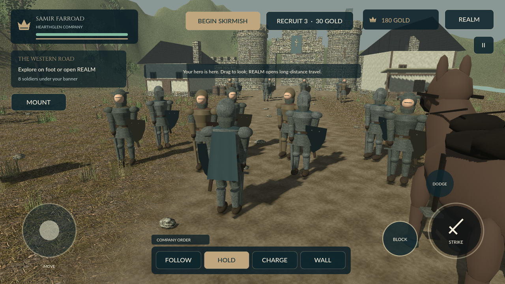

# Iron Crowns — The Ashen Marches

An original Android action-strategy prototype with a **large 3D campaign map** and third-person field battles, built with Godot 4.4.1.



## Combat and presentation rebuild 0.5 — The Western Road

[Download the 0.5 Combat APK and screenshots](https://github.com/s1po0/iron-crowns/releases/tag/v0.5.0-combat-preview).

- **Visible hero first:** new and continued journeys enter the third-person field. REALM opens the strategic map.
- **Shoulder camera:** closer framing, obstacle raycasts, restrained impact movement and less HUD obstruction.
- **Grounded materials and proportions:** rebuilt armor and articulated limbs, worn surfaces, continuous terrain, cutout foliage and instanced grass. No oversized crests or colored foot rings.
- **Combat with timing:** delayed strikes, reach/facing/obstruction checks, directional shields, timed parries, stagger, stamina costs and a real backward dodge.
- **Sound:** original synthesized footsteps, sword swing, shield clash, impact and ambient wind.
- **Graphics settings:** saved Mobile/High presets and sound toggle in the pause menu. Mobile is the default.

This is **one rebuilt shared village/battlefield**, not a photorealistic or AAA replacement for Bannerlord. The art and animation remain procedural; physical-phone performance and extended combat balance are not yet validated.

[0.5 controls and implementation limits](docs/COMBAT_0.5.md) · [Actual Android hero view](docs/screenshots/android-hero.png) · [Strategic map](docs/screenshots/iron-map.png)

## Included wanderer systems (introduced in 0.4)

[Previous 0.4 release](https://github.com/s1po0/iron-crowns/releases/tag/v0.4.0-wanderer-preview).

- **Create Samir Farroad:** Merchant, Pathfinder or Freeblade, with distinct starting benefits.
- **Remain independent:** the neutral oath blocks settlement assaults; no faction pledge is needed.
- **Earn your way:** local courier contracts with real travel, deadlines, cooldowns and one-time payouts.
- **Hire support:** four named tavern specialists with travel, provisioning or caravan abilities.
- **Own businesses, not land:** a companion-led road caravan and up to three income-producing grain mills.
- **Keep a journal:** track explored realms, visited settlements, deliveries, trading margins and operating accounts.
- Save v3 retains your origin, companions, contracts and businesses, while accepting older campaign saves.

[Playable wanderer guide and exact limits](docs/WANDERER_0.4.md) · [Origin screen](docs/screenshots/iron-origin.png) · [In-game journal](docs/screenshots/iron-wanderer.png)

## Existing campaign world

[Previous 0.3 release](https://github.com/s1po0/iron-crowns/releases/tag/v0.3.0-campaign-preview).

- **900 × 680 world-unit strategic map**, about 19× the ground area of the previous diorama.
- **32 settlements:** eight towns, eight castles, sixteen villages; four original factions.
- Sculpted mountains, northern snow, drylands, forests, coastlines, river, roads, bridges, farms and faction standards.
- Pan, pinch/scroll zoom, atlas, settlement inspection and connected-road travel.
- Moving caravans, patrols and raiders; encounters lead into the existing 3D battle arena.
- Local recruiting and grain trade, food consumption, wages, contracts, castle ownership/income and simple hostility/truce rules.
- Persistent company count, campaign position, food, cargo, fiefs, faction standing, stocks and gold.

The visual reference is a **grounded medieval strategy map**, not a copy of Bannerlord's geography, assets or factions. This is **not every system in Mount & Blade II**. See the [implemented/not-implemented feature matrix](docs/CAMPAIGN_0.3.md).

## Play

**Create Wanderer → choose an origin → Start My Journey** puts your visible hero on the western road. Walk with the left stick/WASD, look with right-side drag/right mouse, or press **REALM / M** to open the strategic map. **Continue Journey** resumes a saved game. **JOURNAL / JOBS** opens your logbook, local courier board, companions and businesses. Taking a delivery from Hearthglen to Dusk Tower is a useful first job. Tap a settlement (or use Previous/Next in its panel), then Travel. Time pauses on arrival. Buy food, recruit, trade grain or accept a contract locally. Encounter raiders on the roads. Only legacy Veteran saves retain castle challenges and fief income; new wanderers follow a neutral path.

Drag to pan, pinch/scroll or use +/− to zoom. LOCATE finds the company; ATLAS shows the whole realm. **FIELD CAMP** enters the shared third-person scene; **REALM** returns to the strategic map. Field controls: left stick/WASD, right-side camera drag, Strike/Space, Block/Q, Dodge/Shift, and formation orders.

[Campaign guide and limits](docs/CAMPAIGN_0.3.md) · [Android campaign screenshot](docs/screenshots/android-campaign.png) · [Battle screenshot](docs/screenshots/android-field.png)

## Install and save caveats

Intended for Android 8+ ARM64 phones. Offline and debug-signed for evaluation, not a production/Play Store release. The CI debug certificate may differ from the previous build; Android can require uninstalling it first, which deletes local saves. Compatible-key installs accept prior v1/v2/v3 save data. Existing campaign saves retain their holdings as Veteran captains; they are not automatically replaced with the new origin setup. There is one save slot. Clearing app data creates a new wanderer but deletes the old save. Travel reloads paused and NPC routes restart; interrupted battles restore the pre-battle company count. Physical-device performance and extended playtesting remain outstanding.

## Build and tests

Open `godot/project.godot` in Godot **4.4.1**, using GL Compatibility. Android export needs the official template, JDK 17, Android SDK and a configured debug keystore.

```bash
godot --headless --path godot --editor --import --quit
godot --headless --path godot -- --smoke
godot --headless --path godot --export-debug Android /absolute/output/Iron-Crowns-0.5.0-Combat.apk
```

The [CI workflow](.github/workflows/godot-3d.yml) tests combat, terrain orientation, road connectivity, land-only routes, trade constraints, travel, fiefs and persistence; renders review screenshots; exports the APK; and tests real Android origin selection, companion hiring, courier acceptance/payout, saved neutrality, map travel, pan/zoom, combat, and restart. The wanderer suite also checks deadlines, duplicate payouts, businesses and save migration. Combat tests assert prominent hero framing, camera obstruction, windup timing, directional shields, parry and dodge behavior, graphics density and audio resources. Android tests also exercise graphics/sound settings.

## Boundaries

The larger map is a **separate strategic layer**, not a seamless continent-sized combat scene. Battles and castle challenges reuse one field arena. Actual sieges, unique interiors, dynasty systems, full diplomatic AI, comprehensive troop/equipment trees, cavalry combat, multiplayer and voice acting are not implemented. Owned caravans earn simplified arrival rewards, not simulated commodity orders. Companions are campaign specialists, not extra named combat models. Tournaments, full character skill trees and formal kingdom mercenary contracts are not implemented.

`app/` and `tests/` preserve the legacy Java/Canvas 2D prototype; `godot/` is the current game. [The master GDD](docs/MASTER_GDD_AND_TECHNICAL_PLAN.md) remains a long-term proposal, not a current feature list. Engine and font license notices are bundled under `godot/assets/`.

The 0.5 meadow, masonry and steel material source images are AI-generated original surfaces, not scanned assets. Other material maps, cutouts and sound effects are generated by `scripts/build-field-media.py` (Pillow/numpy); source images live in `art-source/` outside the APK.
