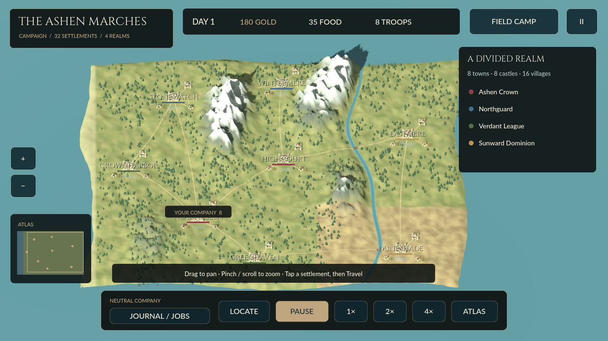

# Iron Crowns — The Ashen Marches

An original Android action-strategy prototype with a **large 3D campaign map** and third-person field battles, built with Godot 4.4.1.



## Campaign update 0.3

[Download the 0.3 campaign APK and screenshots](https://github.com/s1po0/iron-crowns/releases/tag/v0.3.0-campaign-preview).

- **900 × 680 world-unit strategic map**, about 19× the ground area of the previous diorama.
- **32 settlements:** eight towns, eight castles, sixteen villages; four original factions.
- Sculpted mountains, northern snow, drylands, forests, coastlines, river, roads, bridges, farms and faction standards.
- Pan, pinch/scroll zoom, atlas, settlement inspection and connected-road travel.
- Moving caravans, patrols and raiders; encounters lead into the existing 3D battle arena.
- Local recruiting and grain trade, food consumption, wages, contracts, castle ownership/income and simple hostility/truce rules.
- Persistent company count, campaign position, food, cargo, fiefs, faction standing, stocks and gold.

The visual reference is a **grounded medieval strategy map**, not a copy of Bannerlord's geography, assets or factions. This is **not every system in Mount & Blade II**. See the [implemented/not-implemented feature matrix](docs/CAMPAIGN_0.3.md).

## Play

**Begin Campaign** opens the map. Tap a settlement (or use Previous/Next in its panel), then Travel. Time pauses on arrival. Buy food, recruit, trade grain or accept a contract locally. Encounter raiders on the roads, or challenge a castle's garrison. Captured castles pay 18 gold/day.

Drag to pan, pinch/scroll or use +/− to zoom. LOCATE finds the company; ATLAS shows the whole realm. **FIELD CAMP** enters the shared third-person scene; **REALM** returns to the strategic map. Field controls: left stick/WASD, right-side camera drag, Strike/Space, Block/Q, Dash/Shift, and formation orders.

[Campaign guide and limits](docs/CAMPAIGN_0.3.md) · [Android campaign screenshot](docs/screenshots/android-campaign.png) · [Battle screenshot](docs/screenshots/android-field.png)

## Install and save caveats

Intended for Android 8+ ARM64 phones. Offline and debug-signed for evaluation, not a production/Play Store release. The CI debug certificate may differ from the previous build; Android can require uninstalling it first, which deletes local saves. Compatible-key installs accept prior v1/v2 save data. Travel reloads paused and NPC routes restart; interrupted battles restore the pre-battle company count. Physical-device performance and extended playtesting remain outstanding.

## Build and tests

Open `godot/project.godot` in Godot **4.4.1**, using GL Compatibility. Android export needs the official template, JDK 17, Android SDK and a configured debug keystore.

```bash
godot --headless --path godot --editor --import --quit
godot --headless --path godot -- --smoke
godot --headless --path godot --export-debug Android /absolute/output/Iron-Crowns-0.3.0-Campaign.apk
```

The [CI workflow](.github/workflows/godot-3d.yml) tests combat, terrain orientation, road connectivity, land-only routes, trade constraints, travel, fiefs and persistence; renders review screenshots; exports the APK; and tests real Android touch purchases, map travel, saved arrivals, pan/zoom, combat, and restart.

## Boundaries

The larger map is a **separate strategic layer**, not a seamless continent-sized combat scene. Battles and castle challenges reuse one field arena. Actual sieges, unique interiors, dynasty systems, full diplomatic AI, comprehensive troop/equipment trees, cavalry combat, multiplayer and audio are not implemented. Moving caravans are not a full autonomous trade economy.

`app/` and `tests/` preserve the legacy Java/Canvas 2D prototype; `godot/` is the current game. [The master GDD](docs/MASTER_GDD_AND_TECHNICAL_PLAN.md) remains a long-term proposal, not a current feature list. Engine and font license notices are bundled under `godot/assets/`.
